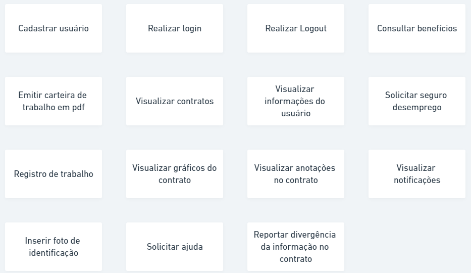

# ATA DE REUNIÃO - 10/08/2021

**Membros presentes**: Todos

## Considerações iniciais
Reunião iniciou 19:15hs via Discord

## Atividades definidas:
* Cada dupla do grupo vai fazer uma persona
* Giulia e Murilo - Questionário
* Liverson e Lucas - Storyboard
* Denniel e Rhuan - Observação Participativa

* Refazer richpicture após elicitação de requisitos - Até 19/08

## Atividades Realizadas

### Brainstorm

 

### Revisão de atividades e atualização do ZenHub
 

## Considerações Finais: 
Reunião finalizou 20:32hs
