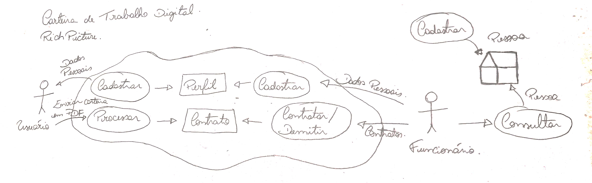
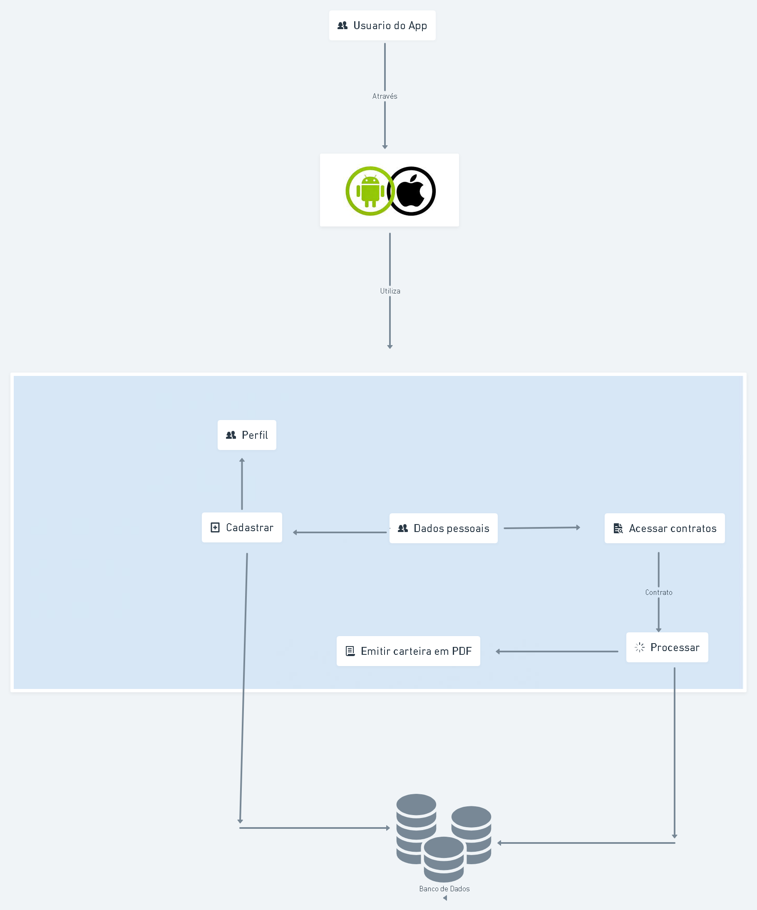
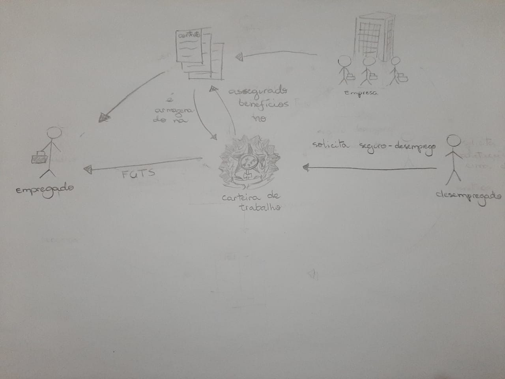

# Rich Picture

## 1.Introdução

É uma abordagem para fazer a interpretação e análise de problemas, através de uma representação por diagrama, onde se inicializa com um problema central que aos poucos se divide em diversos pontos menores. Ele vai ajudar na exploração e representação de um sistema, juntamente com suas interações, atores e dados que estão neste meio, criando assim uma imagem inicial do funcionamento do software analisado.

## 2.Rich Picture - Carteira de trabalho digital

### Rich Picture v1 (Papel)

**Figura 1**: Versão em papel do Rich Picture (Feito em 28/07)

### Rich Picture v2 (Esquema)

**Figura 2**: Versão em diagrama do Rich Picture (Feito em 31/07)

### Rich Picture v3 (Papel)

**Figura 2**: Versão em diagrama do Rich Picture (Feito em 31/07)

## 3. Versionamento

| Versão | Descrição                                 | Data       | Autor(es)                        | Revisor(es)     |
| ------ | ----------------------------------------- | ---------- | -------------------------------- | --------------- |
| 1.0.0  | Criação da primeira versão do documento   | 03/08/2021 | Liverson Paulo e Lucas Rodrigues | Giulia Lobo     |
| 1.1.0  | Adição da primeira versão do Rich Picture | 03/08/2021 | Liverson Paulo                   | Denniel William |
| 1.2.0  | Adição da segunda versão do Rich Picture  | 06/08/2021 | Giulia Lobo                      | Murilo Gomes    |
| 1.2.1  | Adição de legenda nas figuras             | 06/08/2021 | Murilo Gomes                     | Rhuan Marques   |
| 1.3.0  | Adição de nova versão do Rich Picture aplicado a regra de negócio  | 07/09/2021 | Denniel William | Rhuan Marques   |