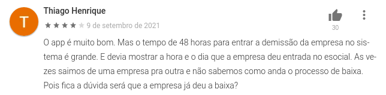
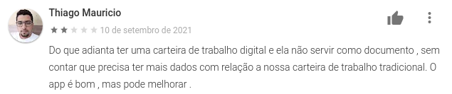
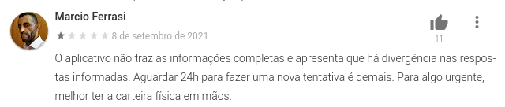
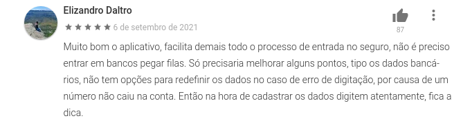
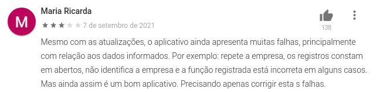

# Comprovação Informal

## 1. Objetivo

Esse documento tem como finalidade apresentar a metodologia utilizada para a validação do produto através da comprovação informal. Sendo assim, os artefatos e requisitos elicitados do produto, irão se basear dos comentários dos clientes para assim obter alguns requisitos que possam não ter sido elicitados quanto melhorias e mudanças nos já levantados. 

* Participante: Denniel William

## 2. Introdução

Comprovação informal se baseia em uma metodologia para conseguir validar as funcionalidades de um projeto. Uma validação se baseia em se o produto ou funcionalidade desenvolvida é a correta, ou seja, se ele faz de fato o que as partes interessadas queriam/esperavam.

## 3. Metodologia

Não há bem uma maneira de se aplicar, o forma padrão de se fazer a comprovação informal. Contudo, comprovação informal em sua definição se tem como uma leitura de descrições feita em linguagem natural e do uso dos clientes para identificar problemas na expressão dos requisitos. 

De forma a obter os feedbacks e para a validação das funcionalidades implementadas no produto, a metodologia utilizada foi uma filtragem da equipe quanto a comentários pertinentes dos <a href="../lexicos#usuario">usuários</a> do aplicativo, esses comentários foram obtidos através das lojas "Google Store" e "Apple Store"

## 4. Comentários filtrados

## 5. Versionamento

| Data       | Versão | Descrição            |         Autor           | Revisor |
|------------|-----|-------------------------|-------------------------|---------|
| 14/09/2021 | 1.0 | Criação do Documento com objetivo, introdução, metodologia e comentários filtrados  | denniel William | Murilo Gomes |
| 27/09/2021 | 1.1 | Rastreabilidade do projeto  | Liverson Paulo e Giulia Lobo | Murilo Gomes |

