# Inspeção

## 1. Introdução

A verificação de um projeto tem como o propósito analisar se os requisitos funcionais e não funcionais estão com os termos de notação, processo e procedimento feitos da forma correta.

A inspeção é um método de verificação no qual são analisados documentos de requisitos. Foi escolhido pelos integrantes do grupo a utilização de checklists com perguntas específicas sobre cada documentação para realizar as avaliações.

* Participantes: Giulia Lobo e Liverson Paulo

## 2. Inspeções

### 2.1 RichPicture

* Responsável: Liverson Paulo

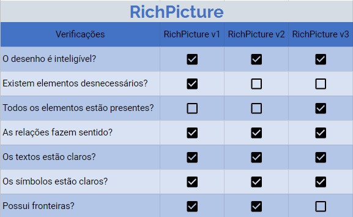

### 2.2 Elicitação (inspeção, questionário, brainstorming)

* Responsável: Giulia Lobo

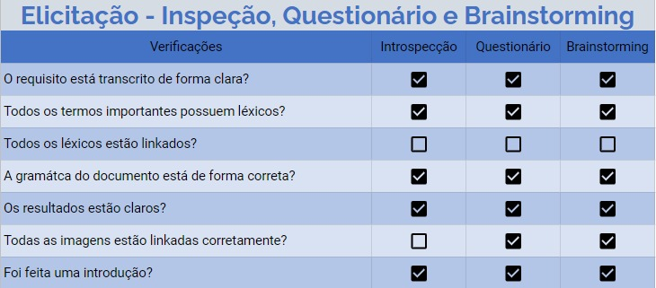

### 2.3 Elicitação (personas)

* Responsável: Giulia Lobo

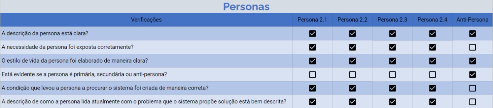

### 2.4 Elicitação (storytelling)

* Responsável: Giulia Lobo

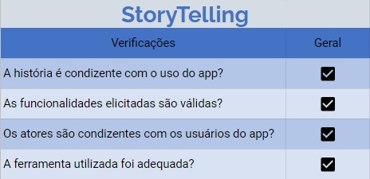

### 2.5 Especificação suplementar

* Responsável: Giulia Lobo

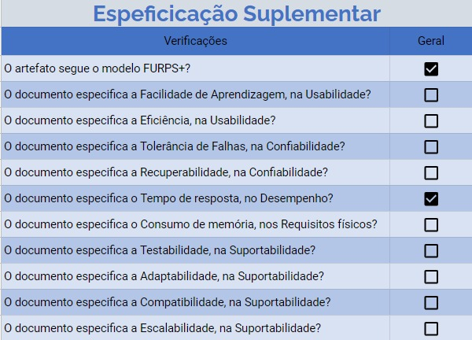

### 2.6 NFR Framework

* Responsável: Liverson Paulo

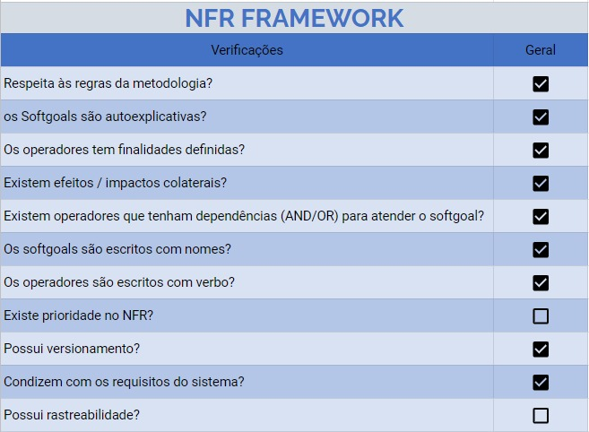

### 2.7 Casos de uso

* Responsável: Liverson Paulo

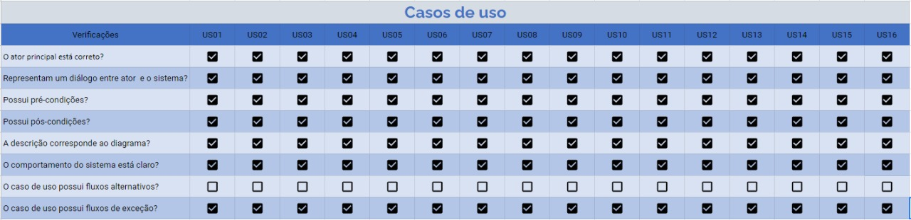

### 2.8 Cenários

* Responsável: Giulia Lobo

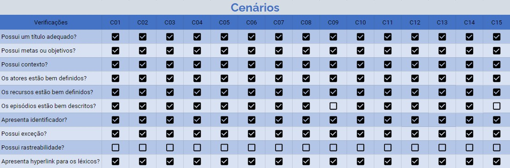

### 2.9 Léxicos

* Responsável: Giulia Lobo

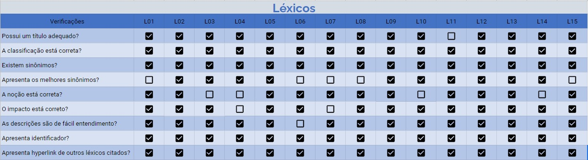

### 2.10 Backlog do produto

* Responsável: Liverson Paulo

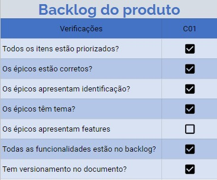

### 2.11 Visão geral do Backlog do produto

* Responsável: Liverson Paulo

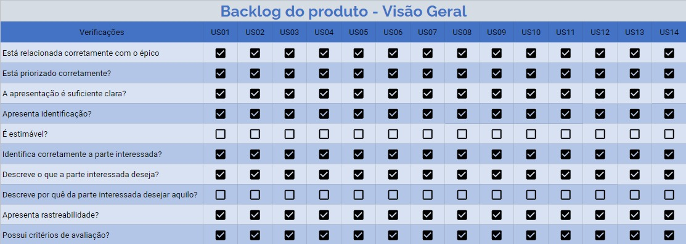

## 3. Conclusão

Foram encontrados alguns erros dos quais modificações se fazem necessárias, a verificação nos ajudou a perceber quais são as mudanças para tornar o projeto mais rico.

Sendo alguns destes:
Sendo estes:

- Melhoria na especificação suplementar
- Falta de ratreabilidade
- Hiperlinks nos léxicos e nos cenários

## 4. Versionamento

| Data       | Versão | Descrição            |         Autor           | Revisor |
|------------|-----|-------------------------|-------------------------|---------|
| 17/09/2021 | 1.0 | Criação do Documento com os Viewpoints e suas devidas explicações e conclusões  | Liverson Paulo e Giulia Lobo | Murilo Gomes |