# Elicitação de requistos

## 1. Brainstorming

# 1.1. Introdução

A atividade de brainstorming funciona para qualquer produto ou serviço, e resulta numa lista priorizada de necessidades e desejos dos usuários. Em geral, essa técnica é utilizada para levantar requisitos e aprender sobre novas características que os usuários apreciariam em um produto, e fornece mais benefícios quando utilizada durante o estágio conceitual do desenvolvimento do produto.

Uma sessão eficiente de brainstorming começa com uma pergunta que sumariza o objetivo de entender o que os usuários querem e precisam no produto. Em vez de pedir para falarem sobre qualquer coisa que queiram, é mais eficiente fazer uma pergunta visando identificar conteúdo, tarefas ou características do produto.

Uma sessão de brainstorming pode ser conduzida em aproximadamente uma hora, e leva menos tempo ainda para analisar os dados de uma sessão, o que torna essa técnica leve em termos de recursos, mas poderosa em termos de resultados.

# 1.2. Metodologia

Para realizarmos nossa sessão de brainstorm, o grupo se reuniu via discord no dia 10/08 e fizemos a seguinte pergunta: Quais funcionalidades são necessárias para um aplicativo da Carteira de Trabalho Digital?
Após isso, os membros foram respondendo a pergunta e preenchendo quadros no site Whimsical de acordo com as respostas.

Depois de preenchidos todos os quadros, o grupo filtrou os requisitos e chegou à conclusão mostrada a seguir:

## 2. Introspecção

### 2.1 Introdução:

Introspecção é uma técnica muito rica e profunda. Consiste em entender quais propriedades o sistema deve possuir para que seja um sucesso. Demanda o Engenheiro de Requisitos imaginar o que ele gostaria, se ele tivesse que desempenhar uma dada tarefa, com os equipamentos disponíveis e demais recursos. Pode ser muito útil, mas tem o problema de que a introspecção de um especialista, de uma área de atuação diferente, não ser adequada para refletir a experiência/atuação real dos interessados. 

### 2.2 Resultado:

- Criar uma conta (carteira de trabalho)
- Logar com essa conta
- Armazenar dados offline
- Pedir alteração da informação do contrato caso esteja errada
- Gerar em CTPS em pdf com contratos escolhidos pelo usuário
- Visualizar contratos da carteira de trabalho
- Visualizar perfil e atualizar um perfil
- Montar um currículo
- Empresas acessar o perfil e contratos do indivíduo para contratação
- Anotações no contrato

## 3. Questionário

### 3.1 Introdução

O questionário, ou pesquisa, é um método que consiste na aplicação de um questionário às partes interessadas e posterior análise da resposta.
É uma técnica que tem como objetivo coletar informações quantitativas e qualitativas de um público alvo numeroso.

### 3.2 Metodologia

Foram elaboradas 17 questões relacionadas a carteira de trabalho digital, sendo que, as 8 primeiras, todas as pessoas que estiverem preenchendo o questionário devem responder. Depois dessas 8, dividimos o questionário em duas seções diferentes onde em uma delas a pessoa já teria utilizado o aplicativo e, em outra, a pessoa não o teria utilizado.

### 3.3 Resultados

No total foram coletadas 47 respostas.

#### Pergunta 1
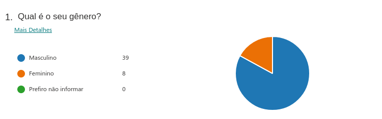

#### Pergunta 2
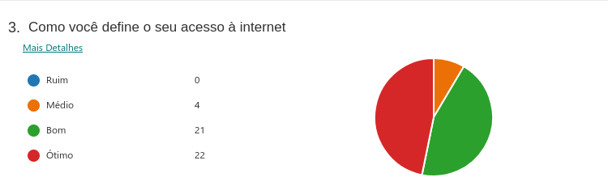

#### Pergunta 3

#### Pergunta 4
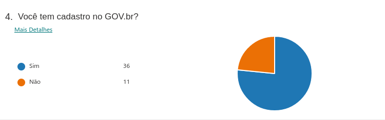

#### Pergunta 5
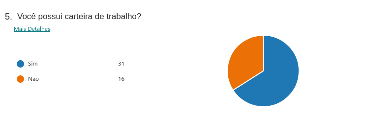

#### Pergunta 6
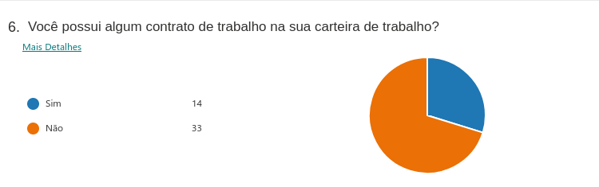

#### Pergunta 7

#### Pergunta 8
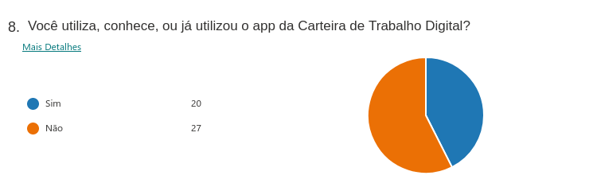

#### Perguntas para quem já utilizou o app

#### Pergunta 9

#### Pergunta 10

#### Pergunta 11

#### Pergunta 12
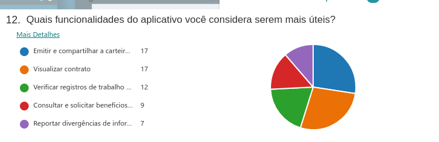

#### Pergunta 13
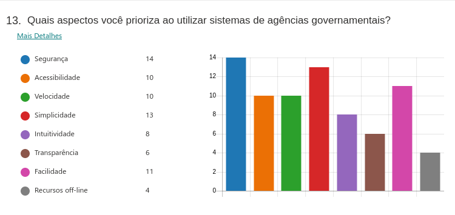

#### Pergunta 14
**Quais aspectos você acredita que precisam melhorar no app?**

Algumas respostas:
 
* Os dados mostrados quando não há nenhum registro;
* Reportar divergências de informações no contrato não funciona;
* O design da carteira gerada em PDF;
* Tamanho do App. Como a carteira de trabalho não tem tantas atualizações, poderia ser facilitado o acesso online, sem necessidade de baixar o app;
* Diminuir a quantidade de bugs;
* Melhorar divulgação do app;

#### Perguntas para quem nunca utilizou o app:

#### Pergunta 15

#### Pergunta 16
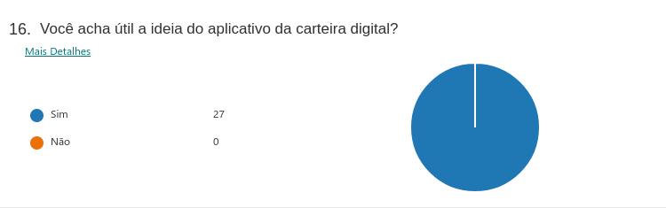

#### Pergunta 17
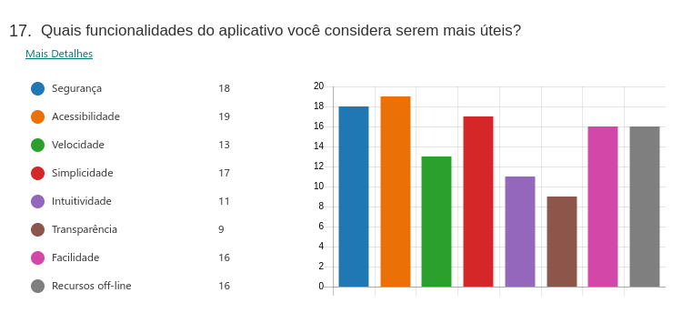

### 3.4 Conclusão
De acordo com as respostas do questionário, podemos perceber que a Carteira de Trabalho Digital é um aplicativo considerado muito útil pela maioria das pessoas. Percebe-se também que as pessoas quase não carregam esse documento físico, não estando preparadas para alguma situação inesperada. Dentre as funcionalidades principais, as mais utilizadas são: emitir e compartilhar a carteira em pdf, visualizar contratos e verificar registros de trabalho. Também foi notado que nem tantas pessoas tinham o conhecimento sobre a existência do aplicativo e isso desmotiva os desenvolvedores a estarem atualizando a aplicação. Logo, os requisitos não são constatemente reavaliados.

### 3.5 Requisitos

Depois de avaliar e tirar a conclusão sobre o questionário, pudemos levantar alguns requisitos da aplicação:

| Número | Requisito                                                    | Tipo de Requisito |
| ------ | ------------------------------------------------------------ | ----------------- |
| 1      | Permitir a emissão da carteira de trabalho em PDF            | Funcional         |
| 2      | Visualizar contratos de trabalhos antigos e atuais           | Funcional         |
| 3      | Verificar registros de trabalho(férias, recisão de contrato e etc.) | Funcional  |
| 4      | Reportar divergências de informaçoes do contrato             | Funcional         |
| 5      | Possuir login integrado com o sistema GOV.br                 | Funcional         |
| 6      | Melhorar o design da carteira em PDF                         | Não Funcional     |
| 7      | Diminuir o tamanho do app, ou fazer uma versão web           | Não Funcional     |
| 8      | Ser seguro                                                   | Não Funcional     |
| 9      | Ser acessível                                                | Não Funcional     |
| 10     | Ser simples                                                  | Não Funcional     |
| 11     | Ser de fácil utilização                                      | Não Funcional     |

## 4. Storytelling

### 4.1 Introdução

Storytelling ou contador de histórias, é definida como uma técnica de elicitação de requisitos, que tem como características a criação de histórias que ilustram as necessidades dos usuários, que tem como característica o compartilhamento de conhecimento.

### 4.2 Storytelling

#### 4.2.1 André Stuart Pereira: 

André é um jovem, de 25 anos, desempregado, muito animado para encontrar um novo emprego. André acorda pela manhã e já está navegando pela internet a procura de vagas de emprego, mas sem muita sorte, uma vez que, a maioria das vagas pedem requisitos que o André não possui. Desanimado com a procura de um novo emprego, João, amigo de André liga, dizendo que na empresa dele de arquitetura tem vagas e ele conseguiu marcar uma entrevista para o André.  

André está indo para a entrevista, chegando lá, a secretaria pediu para que André apresentasse a sua carteira de trabalho, porém, ele percebeu que havia esquecido a sua carteira de trabalho. Já estava prestes a desistir, felizmente a secretária o ajudou, ela disse pra ele que hoje já existe um aplicativo super prático que dar acesso a sua carteira de trabalho, com isso André conseguiu apresentar a sua carteira de trabalho, fazer a entrevista e arrumar o seu novo emprego. 

#### 4.2.2 Fernando Fernandes Sousa: 

Fernando Fernandes Sousa Fernando sempre foi um funcionário exemplar em seu departamento, levantava cedo para chegar no trabalho às 6:30 e sempre era o último funcionário a sair. Com isso, outra empresa o notou e quis convidá-lo a fazer parte de outra empresa, porém Fernando havia perdido sua carteira de trabalho, então tentou se manter na mesma empresa pedindo para que aumentassem seu salário. 
	
Ao pedir o aumento, seu chefe não gostou da proposta já que estava com problemas financeiros na empresa. Ao obter esta informação Fernando decidiu então que iria mudar de empresa e prontamente procurou por sua carteira de trabalho.
	
Desanimado ao não encontrar a carteira, Fernando foi almoçar com um amigo para ter um tempo para pensar, durante o almoço o amigo em questão mostrou para Fernando que não era mais necessário ter uma carteira de trabalho física, apresentando então uma carteira virtual, com a qual Fernando levou para a nova empresa e conseguiu ser contratado com sucesso.

## 5. Priorização MoSCoW

### 5.1. Introdução

A técnica de priorização MosCoW é uma técnica para determinar a prioridade de cada requisito em:
must do: É estreitamente necessário ser feito para a entrega do projeto
should do: São importantes, porém não têm a mesma importância do must do
could do: São desejáveis, porém não são essenciais do ponto de vista estratégico
wont do: São acordados os requisitos de menos importância do projeto, com menor retorno do investimento do produto final

### 5.2. Resultado

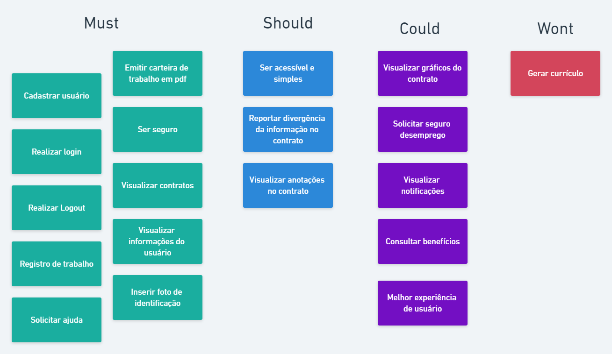

## 6. Bibliografia

* BARBOSA. Simone. SILVA. Bruno. 2010. Interação Humano-computador.
* VAZQUES. Carlos. SOMEIRA SIMÕES. Guilherme. Engenharia de Requisitos.

## 7. Versionamento
| Versão | Descrição| Data| Autor(es)| Revisor(es)|
|--------|----------|-----|----------|------------|
| 1.0.0 | Criação do documento| 20/08/2021 | Liverson Paulo e Lucas Rodrigues | Giulia Lobo e Murilo Gomes |
| 1.1.0 | Criação da priorização| 20/08/2021 | Denniel William e Murilo Gomes | Liverson Paulo |