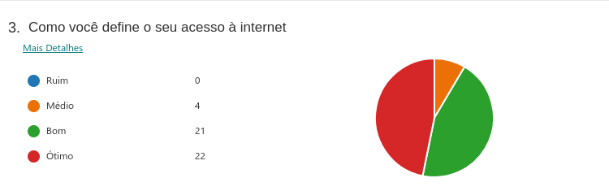
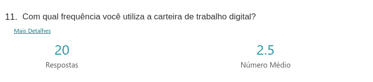
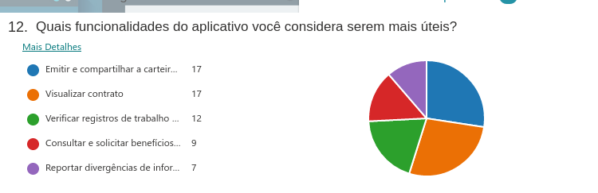
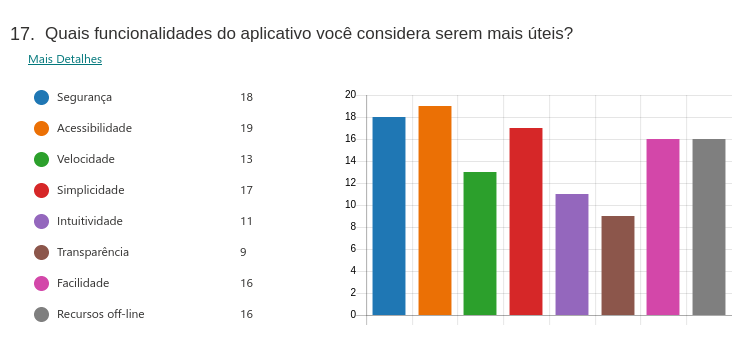

# Questionário

## 1. Introdução

O questionário, ou pesquisa, é um método que consiste na aplicação de um questionário às partes interessadas e posterior análise da resposta.
É uma técnica que tem como objetivo coletar informações quantitativas e qualitativas de um público alvo numeroso.

* Participantes: Murilo Gomes e Giulia Lobo

## 2. Metodologia

Foram elaboradas 17 questões relacionadas a <a href="../../modelagem/lexicos#carteiraDeTrabalhoDigital">carteira de trabalho digital</a>, sendo que, as 8 primeiras, todas as pessoas que estiverem preenchendo o questionário devem responder. Depois dessas 8, dividimos o questionário em duas seções diferentes onde em uma delas a pessoa já teria utilizado o aplicativo e, em outra, a pessoa não o teria utilizado.

## 3. Resultados

No total foram coletadas 47 respostas.

### Pergunta 1

### Pergunta 2

### Pergunta 3

### Pergunta 4

### Pergunta 5

### Pergunta 6

### Pergunta 7

### Pergunta 8

### Perguntas para quem já utilizou o app

### Pergunta 9

### Pergunta 10

### Pergunta 11

### Pergunta 12

### Pergunta 13

### Pergunta 14
**Quais aspectos você acredita que precisam melhorar no app?**

Algumas respostas:
 
* Os dados mostrados quando não há nenhum registro;
* Reportar divergências de informações no contrato não funciona;
* O design da carteira gerada em PDF;
* Tamanho do App. Como a <a href="../../modelagem/lexicos#carteiraDeTrabalho">carteira de trabalho</a> não tem tantas atualizações, poderia ser facilitado o acesso online, sem necessidade de baixar o app;
* Diminuir a quantidade de bugs;
* Melhorar divulgação do app;

### Perguntas para quem nunca utilizou o app:

### Pergunta 15

### Pergunta 16

### Pergunta 17

## 4. Conclusão
De acordo com as respostas do questionário, podemos perceber que a <a href="../../modelagem/lexicos#carteiraDeTrabalhoDigital">carteira de trabalho digital</a> é um aplicativo considerado muito útil pela maioria das pessoas. Percebe-se também que as pessoas quase não carregam esse documento físico, não estando preparadas para alguma situação inesperada. Dentre as funcionalidades principais, as mais utilizadas são: emitir e compartilhar a carteira em pdf, visualizar <a href="../lexicos#contratos">contratos</a> e verificar registros de trabalho. Também foi notado que nem tantas pessoas tinham o conhecimento sobre a existência do aplicativo e isso desmotiva os desenvolvedores a estarem atualizando a aplicação. Logo, os requisitos não são constatemente reavaliados.

## 5. Requisitos

Depois de avaliar e tirar a conclusão sobre o questionário, pudemos levantar alguns requisitos da aplicação:

| Número | Requisito                                                    | Tipo de Requisito |
| ------ | ------------------------------------------------------------ | ----------------- |
| 1      | Permitir a emissão da <a href="../../modelagem/lexicos#carteiraDeTrabalho">carteira de trabalho</a> em PDF            | Funcional         |
| 2      | Visualizar <a href="../lexicos#contratos">contratos</a> de trabalhos antigos e atuais           | Funcional         |
| 3      | Verificar registros de trabalho(férias, recisão de contrato e etc.) | Funcional  |
| 4      | Reportar divergências de informaçoes do contrato             | Funcional         |
| 5      | Possuir login integrado com o sistema GOV.br                 | Funcional         |
| 6      | Melhorar o design da carteira em PDF                         | Não Funcional     |
| 7      | Diminuir o tamanho do app, ou fazer uma versão web           | Não Funcional     |
| 8      | Ser seguro                                                   | Não Funcional     |
| 9      | Ser acessível                                                | Não Funcional     |
| 10     | Ser simples                                                  | Não Funcional     |
| 11     | Ser de fácil utilização                                      | Não Funcional     |

## 6. Versionamento

| Data |  Versão                              | Descrição       | Autor(es)              | Revisor(es)                   |
| ------ | --------------------------------------- | ---------- | ---------------------- | ----------------------------- |
| 19/08/2021 | 1.0 | Criação do documento com os resultados do questionário de elicitação e os requisitos levantados | Murilo Gomes e Giulia Lobo | Denniel William e Rhuan Marques |
| 26/09/2021 | 1.1 | Rastreabilidade do projeto  | Liverson Paulo e Giulia Lobo | Murilo Gomes |
