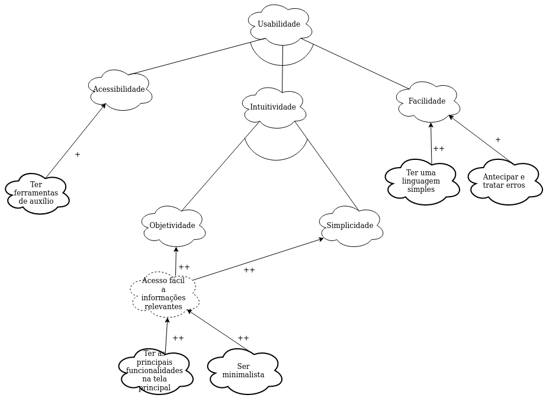
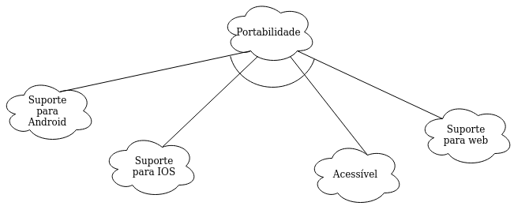
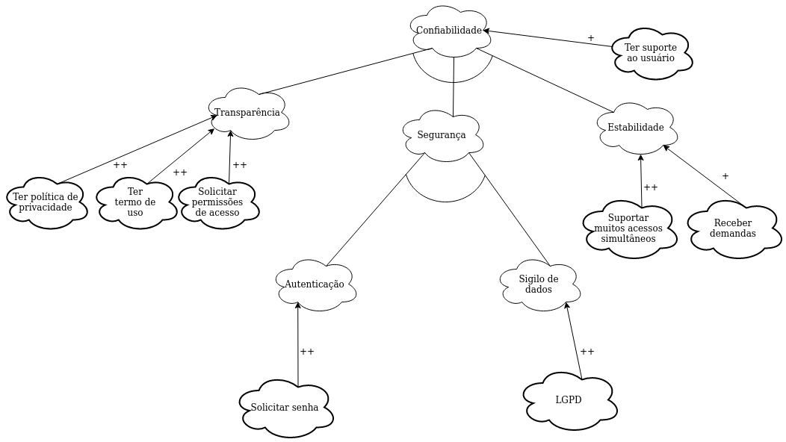
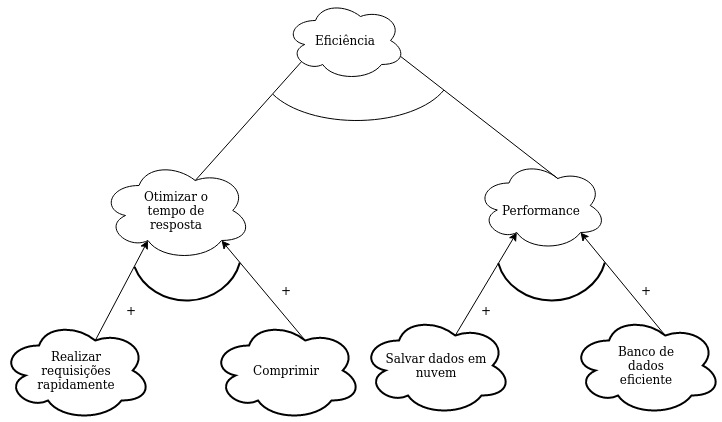

# NFR Framework

## 1. Introdução

Esse artefato tem como funciuonalidade elucidar sobre o uso da ferramenta NFR Framework.

Proposta em 1992 e desenvolvida em 2000, O NFR framework é utilizado para modelar requisitos não funcionais de um sistema.

 Sua estrutura é representada sobre a forma de gráficos SIG (Softgoal Interdependency Grafh – Gráficos de Interdependência de Softgoals) que descrevem as dependências entre softgoals e como eles são decompostos.

## 2. Metodologia

O modelo de NFR Framework possibilita o uso de 114 softgoals, porém para que se tenha o foco na metodologia do projeto, foram escolhidos apenas quatro: Usabilidade, Eficiência, Confiabilidade e Portabilidade. Tais pontos foram definidos com a análise dos requisitos não funcionais

Após a análise dos softgoals, os gráficos foram elaborados com base no padrão do NFR Framework

**Figura 1:** Legenda. **Autor(es):** Grupo Promobit.

## 3. Usabilidade
### 3.1. Sem propagação

## 4. Portabilidade
### 4.1. Sem propagação

## 5. Confiabilidade
### 5.1. Sem propagação

## 6. Eficiência
### 6.1. Sem propagação

## 7. Conclusão

 Com a finalização desse documento, o grupo conseguiu identificar com mais clareza requisistos à serem priorizados durante o projeto.

## 8. Bibliografia`

* CASTRO. Jaelson. Requisitos Não-Funcionais. Disponível em: https://www.cin.ufpe.br/~if716/arquivos20152/experimentoBruno/Aula2/Aula2-Parte2-NFR%20Framework.pdf
* BRITO. Isabel. NFR Framework(Non-Functional Requirements). Disponível em: https://slideplayer.com.br/slide/7294636/
* NFR Framework. Disponível em: https://requisitos-de-software.github.io/2020.1-Promobit/modelagem/nfr_framework/
* NFR Framework. Disponível em: https://requisitos-de-software.github.io/2020.2-CarteiraDigitalTransito/modelagem/nfr_framework/  

## 9. Versionamento

| Data       | Versão | Descrição            |         Autor           | Revisor |
|------------|-----|-------------------------|-------------------------|---------|
| 07/09/2021 | 0.1 | Criação do Documento com tema, épico e história de usuário  | Liverson Paulo e Rhuan Marques | Denniel William |
| 07/09/2021 | 0.2 | Adição dos requisitos | Liverson Paulo e Rhuan Marques | Denniel William |