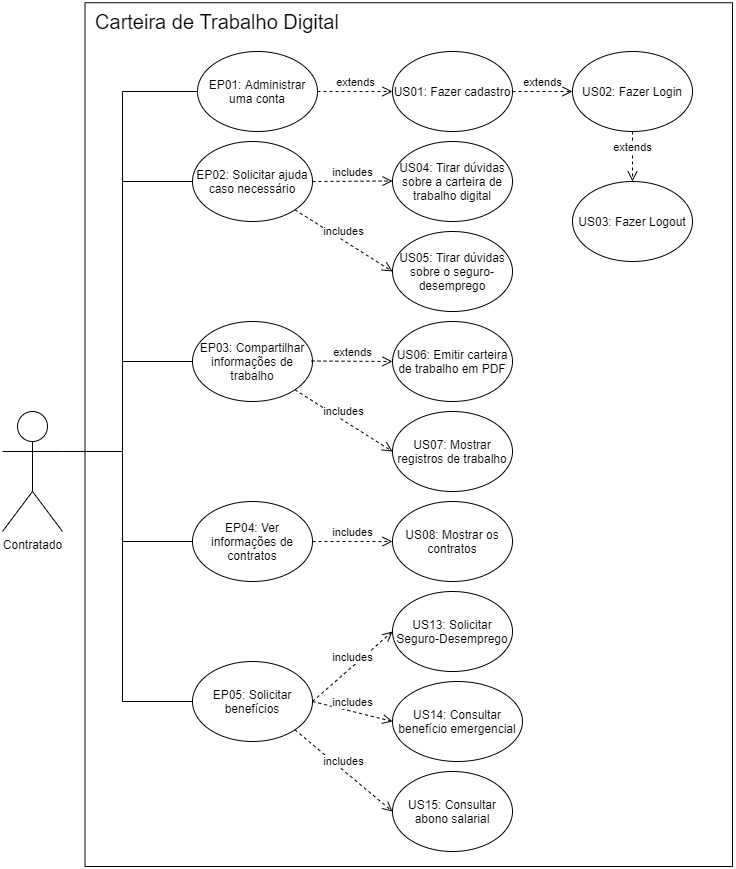

# Casos de uso

## 1. Introdução

Esse artefato é uma técnica que descreve como o usuário realizará as tarefas, dependendo do contexto do software. Descrevendo o ponto do usuário e como o sistema responde as ações, os casos de uso são sequências de passos que são descritos a partir do fluxo.

Os casos de uso integram os requisitos em um pacote abrangente que descreve a interação do usuário com o sistema. Eles começam onde o processo de coleta de requisitos termina. Os requisitos determinam quais Casos de Uso o sistema terá, e muitos dos requisitos se tornarão sua lógica de negócios.

## 2. Diagrama de casos de uso

​									**Figura 1:** Diagrama de casos de uso. **Autor(es)**: Grupo.

## 3. Especificação dos casos de uso

### US01 Fazer o cadastro de usuário

|   US01   | Descrição |
| -------- | --------- |
| Ator | Contratado |
| Pré-condições| Acesso à internet, ter um CPF |
| Pós-condições| O ator terá logado no sistema |

### US02 Fazer o Login de usuário

|   US02   | Descrição |
| -------- | --------- |
| Ator | Contratado |
| Pré-condições| Acesso à internet, ter um CPF |
| Pós-condições| O ator terá logado no sistema |

### US03 Fazer o Logout de usuário

|   US03   | Descrição |
| -------- | --------- |
| Ator | Contratado |
| Pré-condições| Acesso à internet |
| Pós-condições|  O ator estará deslogado do sistema |

### US04 Fazer perguntas sobre a carteira de trabalho digital

|   US04   | Descrição |
| -------- | --------- |
| Ator | Contratado |
| Pré-condições| Acesso à internet |
| Pós-condições| O ator terá respostas sobre a carteira de trabalho digital |

### US05 Fazer perguntas sobre o seguro-desemprego

|   US05   | Descrição |
| -------- | --------- |
| Ator | Contratado |
| Pré-condições| Acesso à internet, estar logado |
| Pós-condições| O ator terá respostas sobre o seguro-desemprego |

### US06 Emitir carteira de trabalho em PDF

|   US06   | Descrição |
| -------- | --------- |
| Ator | Contratado |
| Pré-condições| Estar logado |
| Pós-condições| Usuário poderá baixar um pdf da carteira de trabalho digital |

### US07 Mostrar registros de trabalho

|   US07   | Descrição |
| -------- | --------- |
| Ator | Contratado |
| Pré-condições| Estar logado |
| Pós-condições| O ator pode consultar seus registros de trabalho |

### US08 Mostrar os contratos

|   US08   | Descrição |
| -------- | --------- |
| Ator | Contratado |
| Pré-condições| Acesso à internet, estar logado |
| Pós-condições| O ator pode consultar seus contratos |

### US09 Mostrar registros de trabalho

|   US09   | Descrição |
| -------- | --------- |
| Ator | Contratado |
| Pré-condições| Acesso à internet, estar logado |
| Pós-condições| O ator pode consultar seus registros de trabalho |

### US10 Solicitar seguro-desemprego

|   US10   | Descrição |
| -------- | --------- |
| Ator | Contratado |
| Pré-condições| Acesso à internet, estar logado|
| Pós-condições| O ator terá seu seguro-desemprego solicitado |

### US11 Consultar benefício emergencial

|   US11   | Descrição |
| -------- | --------- |
| Ator | Contratado |
| Pré-condições| Acesso à internet, estar logado |
| Pós-condições| O ator pode ver seu benefício emergencial |

### US12 Consultar abono salarial

|   US12   | Descrição |
| -------- | --------- |
| Ator | Contratado |
| Pré-condições| Acesso à internet, estar logado |
| Pós-condições| O ator pode ver seu abono salarial |

## 4. Versionamento

| Data       | Versão | Descrição            |         Autor           | Revisor |
|------------|-----|-------------------------|-------------------------|---------|
| 24/08/2021 | 0.1 | Criação do Documento com tema, épico e história de usuário  | Rhuan Marques | Giulia Lobo |
