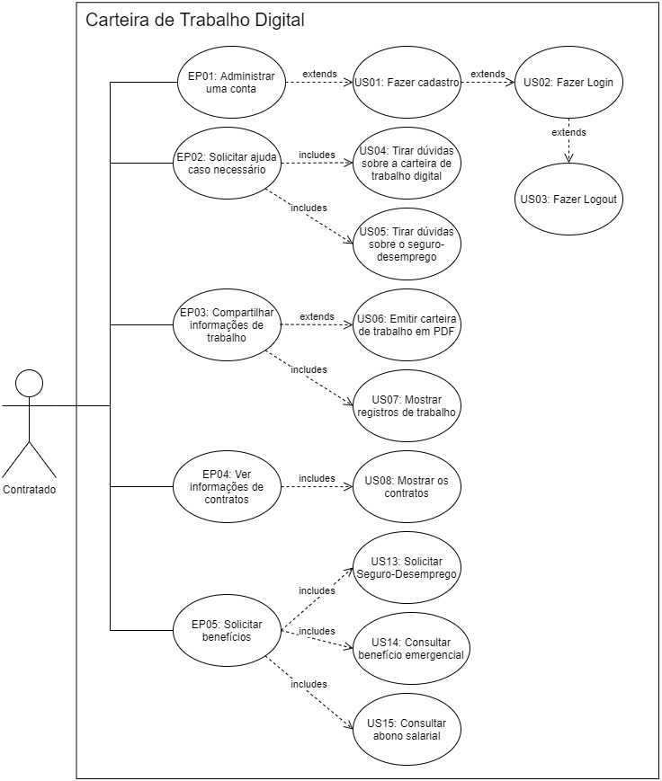
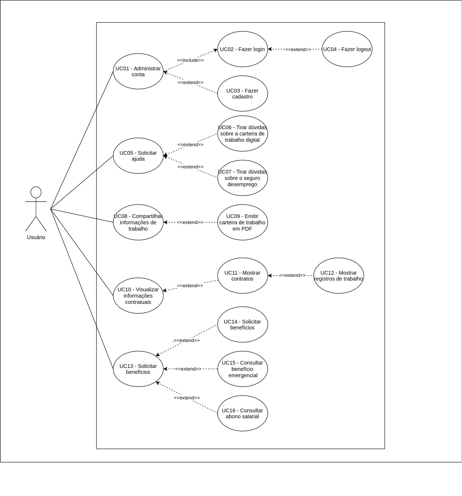

# Casos de uso

## 1. Introdução

Esse artefato é uma técnica que descreve como o <a href="../lexicos#usuario">usuário</a> realizará as tarefas, dependendo do contexto do software. Descrevendo o ponto do <a href="../lexicos#usuario">usuário</a> e como o sistema responde as ações, os casos de uso são sequências de passos que são descritos a partir do fluxo.

Os casos de uso integram os requisitos em um pacote abrangente que descreve a interação do <a href="../lexicos#usuario">usuário</a> com o sistema. Eles começam onde o processo de coleta de requisitos termina. Os requisitos determinam quais Casos de Uso o sistema terá, e muitos dos requisitos se tornarão sua lógica de negócios.

## 2. Metodologia

Para construir o nosso diagrama de casos de uso, primeiramente pegamos de base os requisitos que foram levantados na fase de elicitação.

A partir desses requisitos, foi contruído um product backlog com todos os épicos e as histórias com as quais o grupo irá trabalhar.

E, por último, foram pensadas as relações existentes entre as hgistórias criadas e desenhado o respectivo diagrama.

## 3. Diagrama de casos de uso

### 3.1 Versão 1.0

 

**Figura 1:** Diagrama de casos de uso. 
**Autor(es)**: Grupo.

### 3.2 Versão 2.0

 

**Figura 1:** Diagrama de casos de uso v2. 
**Autor(es)**: Denniel William e Giulia Lobo.

## 4. Especificação dos casos de uso

### US01 - Administrar conta

|   US01   | Descrição |
| -------- | --------- |
| **Ator** | <a href="../lexicos#usuario">usuário</a> |
| **Pré-condições** | <a href="../lexicos#usuario">usuário</a> deve ter conexão a internet |
| **Pós-condições** | <a href="../lexicos#usuario">usuário</a> estará logado no sistema   <a href="../lexicos#usuario">usuário</a> terá <a href="../lexicos#carteiraDeTrabalhoDigital">carteira de trabalho digital</a> |
| **Fluxo principal** | **[FP01] Fluxo iniciado quando um <a href="../lexicos#usuario">usuário</a> inicia o aplicativo:**   1. <a href="../lexicos#usuario">usuário</a> inicia o aplicativo   2. <a href="../lexicos#usuario">usuário</a> clica em entrar |
| **Fluxo(s) alternativo(s)** | - |
| **Fluxo(s) de exceção** | **[FE01] Falha de conexão com a internet** | 

### US02 - Fazer login

|   US02   | Descrição |
| -------- | --------- |
| **Ator** | <a href="../lexicos#usuario">usuário</a> |
| **Pré-condições** | <a href="../lexicos#usuario">usuário</a> deve ter conexão a internet   <a href="../lexicos#usuario">usuário</a> deve ter uma conta registrada com CPF próprio   |
| **Pós-condições** | <a href="../lexicos#usuario">usuário</a> estará logado no sistema.   <a href="../lexicos#usuario">usuário</a> conseguirá acessar funcionalidades do sistema. |
| **Fluxo principal** | **[FP01] Fluxo iniciado quando um <a href="../lexicos#usuario">usuário</a> inicia o aplicativo:**   1. <a href="../lexicos#usuario">usuário</a> inicia o aplicativo;   2. <a href="../lexicos#usuario">usuário</a> clica em entrar;   3. Inserir CPF;   4. Clicar em Avançar;   5. Digitar senha;   6. Clicar em Entrar; |
| **Fluxo(s) alternativo(s)** | - |
| **Fluxo(s) de exceção** | **[FE01] Falha de conexão com a internet**   **[FE02] CPF inválido:**   No passo 3 do [FP01] foi inserido um CPF inválido ou não cadastrado   **[FE03] Senha incorreta:**   No passo 5 do [FP01] foi inserido uma senha não correspondente a conta cadastrada | 

### US03 - Fazer cadastro

|   US03   | Descrição |
| -------- | --------- |
| **Ator** | <a href="../lexicos#usuario">usuário</a> |
| **Pré-condições** | <a href="../lexicos#usuario">usuário</a> deve ter conexão a internet   <a href="../lexicos#usuario">usuário</a> deve ter CPF próprio   |
| **Pós-condições** | <a href="../lexicos#usuario">usuário</a> estará logado no sistema.   <a href="../lexicos#usuario">usuário</a> terá conta cadastrada na <a href="../lexicos#carteiraDeTrabalhoDigital">carteira de trabalho digital</a> |
| **Fluxo principal** | **[FP01] Fluxo iniciado ao clicar em Crie sua conta na página de login:**   1. <a href="../lexicos#usuario">usuário</a> seleciona a opção de cadastro;   2. <a href="../lexicos#usuario">usuário</a> confirma suas informações entre as informações visualizadas;   3. <a href="../lexicos#usuario">usuário</a> digita e confirma senha   4. <a href="../lexicos#usuario">usuário</a> valida se não é um robô;   5. <a href="../lexicos#usuario">usuário</a> confirma cadastro; |
| **Fluxo(s) alternativo(s)** | - |
| **Fluxo(s) de exceção** | **[FE01] Falha de conexão com a internet**   **[FE02] Informação inválida:**   No passo 2 do [FP01] o <a href="../lexicos#usuario">usuário</a> escolhe uma ou mais informações erradas sobre seu registro governamental   **[FE03] Senhas incompatíveis:**   No passo 3 do [FP01] <a href="../lexicos#usuario">usuário</a> digita senha diferentes no campo de digitar e confirmar senha   **[FE04] Senhas inválida:**   No passo 3 do [FP01] <a href="../lexicos#usuario">usuário</a> digita que não esteja de acordo ao explicitado nas regras do cadastro | 

### US04 - Fazer logout

|   US04   | Descrição |
| -------- | --------- |
| **Ator** | <a href="../lexicos#usuario">usuário</a> |
| **Pré-condições** | <a href="../lexicos#usuario">usuário</a> deve ter conexão a internet   <a href="../lexicos#usuario">usuário</a> deve ter uma conta registrada com CPF próprio   <a href="../lexicos#usuario">usuário</a> deve estar logado no aplicativo |
| **Pós-condições** | <a href="../lexicos#usuario">usuário</a> será desconectado do sistema.|
| **Fluxo principal** | **[FP01] Fluxo iniciado quando um <a href="../lexicos#usuario">usuário</a> está logado no aplicativo**   1. <a href="../lexicos#usuario">usuário</a> clica em "Mais" nas opções do aplicativo;   2. <a href="../lexicos#usuario">usuário</a> clica em Sair; |
| **Fluxo(s) alternativo(s)** | - |
| **Fluxo(s) de exceção** | **[FE01] Falha de conexão com a internet  ** | 

### US05 - Solicitar <a href="../lexicos#ajuda">Ajuda</a>

|   US05   | Descrição |
| -------- | --------- |
| **Ator** | <a href="../lexicos#usuario">usuário</a> |
| **Pré-condições** | <a href="../lexicos#usuario">usuário</a> deve ter conexão a internet   <a href="../lexicos#usuario">usuário</a> deve estar logado no aplicativo |
| **Pós-condições** | <a href="../lexicos#usuario">usuário</a> visualizou as opções de perguntas do aplicativo |
| **Fluxo principal** | **[FP01] Fluxo iniciado quando um <a href="../lexicos#usuario">usuário</a> está logado no aplicativo**   1. <a href="../lexicos#usuario">usuário</a> clica em "Mais" nas opções do aplicativo;   2. <a href="../lexicos#usuario">usuário</a> visualiza as opções de perguntas; |
| **Fluxo(s) alternativo(s)** | - |
| **Fluxo(s) de exceção** | **[FE01] Falha de conexão com a internet  ** | 

tirar dúvidas sobre a  <a href="../lexicos#carteiraDeTrabalhoDigital">carteira de trabalho digital</a>

### US06 - Tirar dúvidas sobre a <a href="../lexicos#carteiraDeTrabalhoDigital">carteira de trabalho digital</a>

|   US06   | Descrição |
| -------- | --------- |
| **Ator** | <a href="../lexicos#usuario">usuário</a> |
| **Pré-condições** | <a href="../lexicos#usuario">usuário</a> deve ter conexão a internet   <a href="../lexicos#usuario">usuário</a> deve estar logado no aplicativo |
| **Pós-condições** | <a href="../lexicos#usuario">usuário</a> presente na página de perguntas frequentes da <a href="../lexicos#carteiraDeTrabalhoDigital">carteira de trabalho digital</a> |
| **Fluxo principal** | **[FP01] Fluxo iniciado quando um <a href="../lexicos#usuario">usuário</a> clica em mais opções no aplicativo:**   1. <a href="../lexicos#usuario">usuário</a> clica em perguntas frequentes <a href="../lexicos#carteiraDeTrabalhoDigital">carteira de trabalho digital</a>;   2. <a href="../lexicos#usuario">usuário</a> percorre a página a procura de perguntas para sanar sua dúvida; |
| **Fluxo(s) alternativo(s)** | - |
| **Fluxo(s) de exceção** | **[FE01] Falha de conexão com a internet  ** **[FE02] Página gov.br com serviço indisponível** | 

### US07 - Tirar dúvidas sobre o seguro desemprego

|   US07   | Descrição |
| -------- | --------- |
| **Ator** | <a href="../lexicos#usuario">usuário</a> |
| **Pré-condições** | <a href="../lexicos#usuario">usuário</a> deve ter conexão a internet   <a href="../lexicos#usuario">usuário</a> deve estar logado no aplicativo |
| **Pós-condições** | <a href="../lexicos#usuario">usuário</a> presente na página de perguntas frequentes seguro desemprego |
| **Fluxo principal** | **[FP01] Fluxo iniciado quando um <a href="../lexicos#usuario">usuário</a> clica em mais opções no aplicativo:**   1. <a href="../lexicos#usuario">usuário</a> clica em perguntas frequentes seguro desemprego;   2. <a href="../lexicos#usuario">usuário</a> percorre a página a procura de perguntas para sanar sua dúvida; |
| **Fluxo(s) alternativo(s)** | - |
| **Fluxo(s) de exceção** | **[FE01] Falha de conexão com a internet  ** **[FE02] Página gov.br com serviço indisponível** | 

### US08 - Compartilhar informações de trabalho

|   US08   | Descrição |
| -------- | --------- |
| **Ator** | <a href="../lexicos#usuario">usuário</a> |
| **Pré-condições** | <a href="../lexicos#usuario">usuário</a> deve ter conexão a internet   <a href="../lexicos#usuario">usuário</a> deve estar logado no aplicativo |
| **Pós-condições** | <a href="../lexicos#usuario">usuário</a> é capaz de visualizar as informações cadastradas por ele |
| **Fluxo principal** | **[FP01] Fluxo iniciado quando um <a href="../lexicos#usuario">usuário</a> está cadastrado no aplicativo**   1. <a href="../lexicos#usuario">usuário</a> clica no ícone do <a href="../lexicos#usuario">usuário</a> nas opções do aplicativo;   2. <a href="../lexicos#usuario">usuário</a> visualiza as informações cadastradas; |
| **Fluxo(s) alternativo(s)** | - |
| **Fluxo(s) de exceção** | **[FE01] Falha de conexão com a internet  **| 

### US09 - Emitir <a href="../lexicos#carteiraDeTrabalho">carteira de trabalho</a> em PDF

|   US09   | Descrição |
| -------- | --------- |
| **Ator** | <a href="../lexicos#usuario">usuário</a> |
| **Pré-condições** | <a href="../lexicos#usuario">usuário</a> deve ter conexão a internet   <a href="../lexicos#usuario">usuário</a> deve estar logado no aplicativo |
| **Pós-condições** | <a href="../lexicos#usuario">usuário</a> é capaz de visualizar as informações cadastradas por ele |
| **Fluxo principal** | **[FP01] Fluxo iniciado quando um <a href="../lexicos#usuario">usuário</a> está cadastrado no aplicativo**   1. <a href="../lexicos#usuario">usuário</a> clica em <a  href="../lexicos#enviar">enviar</a> na barra inferior do aplicativo;   2. <a href="../lexicos#usuario">usuário</a> seleciona as informações que deseja gerar no pdf;   3. <a href="../lexicos#usuario">usuário</a> clica no ícone do PDF; |
| **Fluxo(s) alternativo(s)** | - |
| **Fluxo(s) de exceção** | **[FE01] Falha de conexão com a internet  ** **[FE02] Falha ao visualizar PDF  ** | 

### US10 - Visualizar informações contratuais

|   US10   | Descrição |
| -------- | --------- |
| **Ator** | <a href="../lexicos#usuario">usuário</a> |
| **Pré-condições** | <a href="../lexicos#usuario">usuário</a> deve ter conexão a internet   <a href="../lexicos#usuario">usuário</a> deve estar logado no aplicativo   <a href="../lexicos#usuario">usuário</a> deve ter <a href="../lexicos#contratos">contratos</a> registrado na conta |
| **Pós-condições** | <a href="../lexicos#usuario">usuário</a> é capaz de visualizar os <a href="../lexicos#contratos">contratos</a> registrados em sua <a href="../lexicos#carteiraDeTrabalho">carteira de trabalho</a> |
| **Fluxo principal** | **[FP01] Fluxo iniciado quando um <a href="../lexicos#usuario">usuário</a> está logado no aplicativo**   1. <a href="../lexicos#usuario">usuário</a> clica em <a href="../lexicos#contratos">contratos</a> na barra inferior do aplicativo; |
| **Fluxo(s) alternativo(s)** | - |
| **Fluxo(s) de exceção** | **[FE01] Falha de conexão com a internet  ** **[FE02] <a href="../lexicos#usuario">usuário</a> não possui <a href="../lexicos#contratos">contratos</a>  ** **[FE03] <a href="../lexicos#usuario">usuário</a> sem permissão para essa funcionalidade  **| 

### US11 - Mostrar <a href="../lexicos#contratos">contratos</a>

|   US11   | Descrição |
| -------- | --------- |
| **Ator** | <a href="../lexicos#usuario">usuário</a> |
| **Pré-condições** | <a href="../lexicos#usuario">usuário</a> deve ter conexão a internet   <a href="../lexicos#usuario">usuário</a> deve estar logado no aplicativo   <a href="../lexicos#usuario">usuário</a> deve ter <a href="../lexicos#contratos">contratos</a> registrado na conta |
| **Pós-condições** | <a href="../lexicos#usuario">usuário</a> é capaz de visualizar os <a href="../lexicos#contratos">contratos</a> registrados em sua <a href="../lexicos#carteiraDeTrabalho">carteira de trabalho</a> |
| **Fluxo principal** | **[FP01] Fluxo iniciado quando um <a href="../lexicos#usuario">usuário</a> está logado no aplicativo**   1. <a href="../lexicos#usuario">usuário</a> clica em <a href="../lexicos#contratos">contratos</a> na barra inferior do aplicativo;   2. <a href="../lexicos#usuario">usuário</a> visualiza <a href="../lexicos#contratos">contratos</a> registrados na <a href="../lexicos#carteiraDeTrabalho">carteira de trabalho</a> |
| **Fluxo(s) alternativo(s)** | - |
| **Fluxo(s) de exceção** | **[FE01] Falha de conexão com a internet  ** **[FE02] <a href="../lexicos#usuario">usuário</a> não possui <a href="../lexicos#contratos">contratos</a>  ** **[FE03] <a href="../lexicos#usuario">usuário</a> sem permissão para essa funcionalidade  **|

### US12 - Mostrar registros de trabalho

|   US12   | Descrição |
| -------- | --------- |
| **Ator** | <a href="../lexicos#usuario">usuário</a> |
| **Pré-condições** | <a href="../lexicos#usuario">usuário</a> deve ter conexão a internet   <a href="../lexicos#usuario">usuário</a> deve estar logado no aplicativo   <a href="../lexicos#usuario">usuário</a> deve ter <a href="../lexicos#contratos">contratos</a> registrado na conta |
| **Pós-condições** | <a href="../lexicos#usuario">usuário</a> é capaz de visualizar os registros de trabalho dos <a href="../lexicos#contratos">contratos</a> registrados em sua <a href="../lexicos#carteiraDeTrabalho">carteira de trabalho</a> |
| **Fluxo principal** | **[FP01] Fluxo iniciado quando um <a href="../lexicos#usuario">usuário</a> está logado no aplicativo**   1. <a href="../lexicos#usuario">usuário</a> clica em <a href="../lexicos#contratos">contratos</a> na barra inferior do aplicativo;    2. <a href="../lexicos#usuario">usuário</a> seleciona um contrato; |
| **Fluxo(s) alternativo(s)** | - |
| **Fluxo(s) de exceção** | **[FE01] Falha de conexão com a internet  ** **[FE02] <a href="../lexicos#usuario">usuário</a> não possui <a href="../lexicos#contratos">contratos</a>  ** **[FE03] <a href="../lexicos#usuario">usuário</a> sem permissão para essa funcionalidade  **|

### US13 - Solicitar <a href="../lexicos#beneficios">benefícios</a>

|   US13   | Descrição |
| -------- | --------- |
| **Ator** | <a href="../lexicos#usuario">usuário</a> |
| **Pré-condições** | <a href="../lexicos#usuario">usuário</a> deve ter conexão a internet   <a href="../lexicos#usuario">usuário</a> deve estar logado no aplicativo   <a href="../lexicos#usuario">usuário</a> deve ter <a href="../lexicos#contratos">contratos</a> registrado na conta |
| **Pós-condições** | <a href="../lexicos#usuario">usuário</a> é capaz de visualizar os <a href="../lexicos#contratos">contratos</a> registrados em sua <a href="../lexicos#carteiraDeTrabalho">carteira de trabalho</a> |
| **Fluxo principal** | **[FP01] Fluxo iniciado quando um <a href="../lexicos#usuario">usuário</a> está logado no aplicativo**   1. <a href="../lexicos#usuario">usuário</a> clica em <a href="../lexicos#beneficios">benefícios</a> na barra inferior do aplicativo;   2. <a href="../lexicos#usuario">usuário</a> visualiza <a href="../lexicos#beneficios">benefícios</a> da <a href="../lexicos#carteiraDeTrabalho">carteira de trabalho</a> |
| **Fluxo(s) alternativo(s)** | - |
| **Fluxo(s) de exceção** | **[FE01] Falha de conexão com a internet  ** **[FE02] <a href="../lexicos#usuario">usuário</a> não tem permissão para solicitar qualquer <a href="../lexicos#beneficios">benefício</a>  ** **[FE03] <a href="../lexicos#usuario">usuário</a> sem permissão para essa funcionalidade  **|

### US14 - Solicitar outros <a href="../lexicos#beneficios">benefícios</a>

|   US14   | Descrição |
| -------- | --------- |
| **Ator** | <a href="../lexicos#usuario">usuário</a> |
| **Pré-condições** | <a href="../lexicos#usuario">usuário</a> deve ter conexão a internet   <a href="../lexicos#usuario">usuário</a> deve estar logado no aplicativo   <a href="../lexicos#usuario">usuário</a> deve ter <a href="../lexicos#contratos">contratos</a> registrado na conta |
| **Pós-condições** | <a href="../lexicos#usuario">usuário</a> é capaz de visualizar os <a href="../lexicos#contratos">contratos</a> registrados em sua <a href="../lexicos#carteiraDeTrabalho">carteira de trabalho</a> |
| **Fluxo principal** | **[FP01] Fluxo iniciado quando um <a href="../lexicos#usuario">usuário</a> está logado no aplicativo**   1. <a href="../lexicos#usuario">usuário</a> clica em <a href="../lexicos#beneficios">benefícios</a> na barra inferior do aplicativo;   2. <a href="../lexicos#usuario">usuário</a> visualiza <a href="../lexicos#beneficios">benefícios</a> da <a href="../lexicos#carteiraDeTrabalho">carteira de trabalho</a> |
| **Fluxo(s) alternativo(s)** | - |
| **Fluxo(s) de exceção** | **[FE01] Falha de conexão com a internet  ** **[FE02] <a href="../lexicos#usuario">usuário</a> não tem permissão para solicitar qualquer <a href="../lexicos#beneficios">benefício</a>  ** **[FE03] <a href="../lexicos#usuario">usuário</a> sem permissão para essa funcionalidade  **|

### US15 - Consultar <a href="../lexicos#beneficioEmergencial">Benefício emergencial</a>

|   US15   | Descrição |
| -------- | --------- |
| **Ator** | <a href="../lexicos#usuario">usuário</a> |
| **Pré-condições** | <a href="../lexicos#usuario">usuário</a> deve ter conexão a internet   <a href="../lexicos#usuario">usuário</a> deve estar logado no aplicativo   <a href="../lexicos#usuario">usuário</a> deve ter <a href="../lexicos#contratos">contratos</a> registrado na conta |
| **Pós-condições** | <a href="../lexicos#usuario">usuário</a> é capaz de visualizar os <a href="../lexicos#contratos">contratos</a> registrados em sua <a href="../lexicos#carteiraDeTrabalho">carteira de trabalho</a> |
| **Fluxo principal** | **[FP01] Fluxo iniciado quando um <a href="../lexicos#usuario">usuário</a> está logado no aplicativo**   1. <a href="../lexicos#usuario">usuário</a> clica em <a href="../lexicos#beneficios">benefícios</a> na barra inferior do aplicativo;   2. <a href="../lexicos#usuario">usuário</a> clica em consultar <a href="../lexicos#beneficioEmergencial">Benefício emergencial</a>; |
| **Fluxo(s) alternativo(s)** | - |
| **Fluxo(s) de exceção** | **[FE01] Falha de conexão com a internet  ** **[FE02] <a href="../lexicos#usuario">usuário</a> não tem permissão para solicitar <a href="../lexicos#beneficios">benefício</a>  ** **[FE03] <a href="../lexicos#usuario">usuário</a> sem permissão para essa funcionalidade  **|

### US16 - Consultar <a href="../lexicos#abonoSalarial">Abono Salarial</a>

|   US16   | Descrição |
| -------- | --------- |
| **Ator** | <a href="../lexicos#usuario">usuário</a> |
| **Pré-condições** | <a href="../lexicos#usuario">usuário</a> deve ter conexão a internet   <a href="../lexicos#usuario">usuário</a> deve estar logado no aplicativo   <a href="../lexicos#usuario">usuário</a> deve ter <a href="../lexicos#contratos">contratos</a> registrado na conta |
| **Pós-condições** | <a href="../lexicos#usuario">usuário</a> é capaz de visualizar os <a href="../lexicos#contratos">contratos</a> registrados em sua <a href="../lexicos#carteiraDeTrabalho">carteira de trabalho</a> |
| **Fluxo principal** | **[FP01] Fluxo iniciado quando um <a href="../lexicos#usuario">usuário</a> está logado no aplicativo**   1. <a href="../lexicos#usuario">usuário</a> clica em <a href="../lexicos#beneficios">benefícios</a> na barra inferior do aplicativo;   2. <a href="../lexicos#usuario">usuário</a> clica em consultar <a href="../lexicos#abonoSalarial">Abono Salarial</a>; |
| **Fluxo(s) alternativo(s)** | - |
| **Fluxo(s) de exceção** | **[FE01] Falha de conexão com a internet  ** **[FE02] <a href="../lexicos#usuario">usuário</a> não tem permissão para solicitar <a href="../lexicos#beneficios">benefício</a>  ** **[FE03] <a href="../lexicos#usuario">usuário</a> sem permissão para essa funcionalidade  **|

## 5. Versionamento

| Data       | Versão | Descrição            |         Autor           | Revisor |
|------------|-----|-------------------------|-------------------------|---------|
| 24/08/2021 | 0.1 | Criação do Documento com tema, épico e história de <a href="../lexicos#usuario">usuário</a>  | Rhuan Marques | Giulia Lobo |
| 07/09/2021 | 1.0 | Adição da nova versão do diagrama e finalização das tabelas de caso de uso  | Denniel William | Giulia Lobo |
| 26/09/2021 | 1.1 | Rastreabilidade do projeto  | Liverson Paulo e Giulia Lobo | Murilo Gomes |
