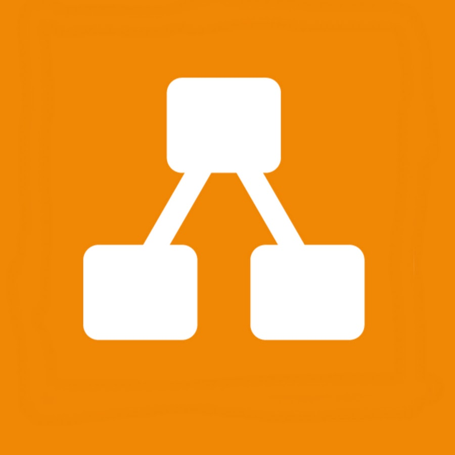
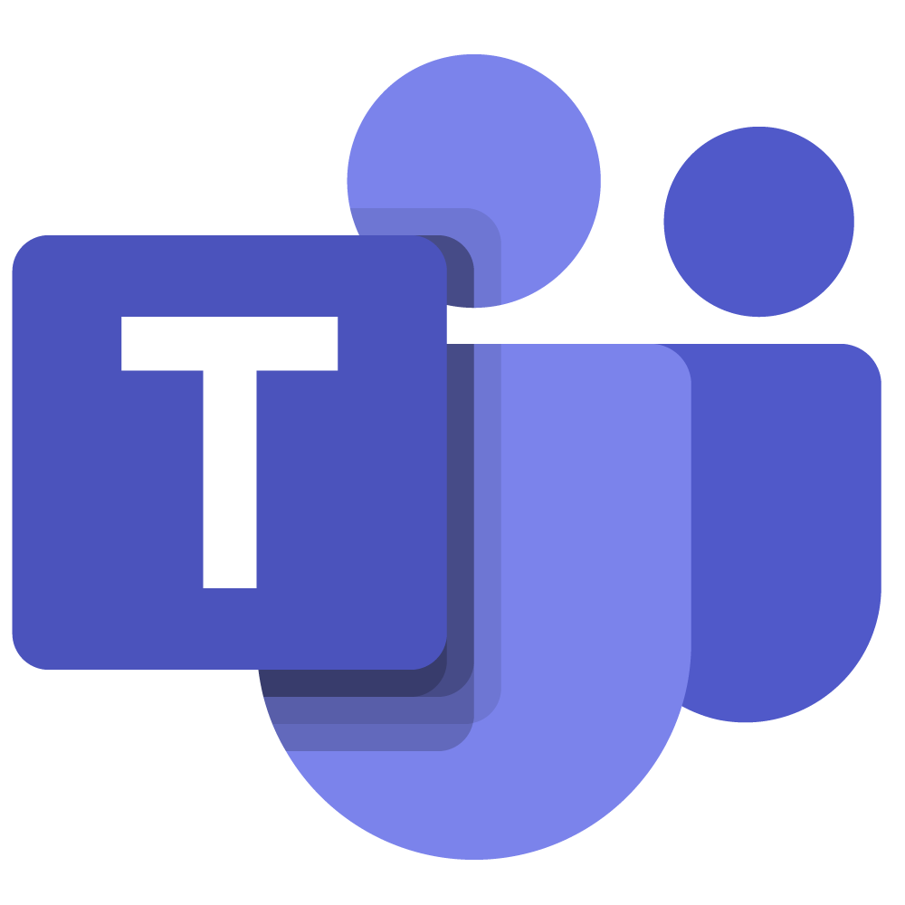

# DPlanejamento

## 1. Objetivo

  Esse documento tem como objetivo apresentar todo o planejamento do projeto, descrevendo: os aplicativos analisados, o cronograma de atividades, a metodologia e as ferramentas utilizadas

 

## 2. Aplicativos Analisados

Antes de inicializar o projeto, cada integrante do grupo teve que realizar o RichPicture de algum aplicativo selecionado. Sendo que, o aplicativo escolhido para o projeto da disciplina poderia ser escolhido entre esses aplicativos. 

Aplicativos analisados:

* Carteira de Trabalho Digital - Liverson
* HBO Max - Lucas
* LinkedIn - Giulia
* Shopee - Murilo
* Tinder - Rhuan
* Udemy - Denniel

Em consenso com toda a equipe, foi selecionada a **Carteira de Trabalho Digital** como o aplicativo a ser utilizado no projeto.

 

## 3. Cronograma de atividades

  Foi organizado um cronograma de atividades seguindo as datas definidas no plano de ensino, é importante avisar que algumas datas podem sofrer alterações.

| Etapa                              | Descrição                                              | Começo     | Final      |
| ---------------------------------- | ------------------------------------------------------ | ---------- | ---------- |
| 1 - Pré - Rastreabilidade          | Planejamento e RichPicture                             | 29/07/2021 | 04/08/2021 |
| 2 - Elicitação de Requisitos       | Técnicas e Priorização                                 | 10/08/2021 | 21/08/2021 |
| 3 - Modelagem de Requisitos        | Cenários, Léxico, Use Case e Especificação suplementar | 17/08/2021 | 30/08/2021 |
| 4 - Modelagem de Requisitos - Ágil | Histórias de Usuário, Backlogs e NFR framework         | 26/08/2021 | 11/09/2021 |
| 5 - Análise de Requisitos          | Verificação e Validação                                | 09/09/2021 | 18/09/2021 |
| 6 - Pós - Rastreabilidade          | Gerência II                                            | 14/09/2021 | 09/10/2021 |
| 7 - Projeto final                  | Apresentação do projeto final                          | 05/10/2021 | 20/10/2021 |

 

## 4. Metodologias ##

### 4.1. eXtreme Programming (XP)

Extreme programming é um método ágil para facilitar o trabalho em grupo, seguindo cinco valores básicos:

* Simplicidade
* Comunicação
* Feedback
* Respeito
* Coragem

### 4.2. Kanban

​									**Figura 1:** Representação do Kanban

O Kanban será utilizado através da ferramenta ZenHub para melhor organização das tarefas entre os membros.

### 4.3. Git Flow

**Figura 2:** Representação do GitFlow

Os commits e as adições de documentações no github serão feitas no padrão do Git Flow, sendo necessária a criação de branches novas a partir da branch develop para adicionar as features principais, isso organizará melhor o repositório, evitando conflitos e versões erradas do projeto, também serão utilizadas as funções de issues e pull-requests existentes no github para melhor organização das tarefas.

### 4.4. Reuniões:

O grupo decidiu se organizar em dois tipos de reuniões:

* **Terça e Quinta no horário da aula(10:00-12:00):** Cada integrante do grupo deve, de maneira escrita, dar um feedback do que ele fez no projeto, o que ele está fazendo e quais são suas dificuldades de executar suas tarefas.
* **Sexta-feira as 19:00:** Todos os integrantes se reúnem em chamada para discutir sobre o projeto e dividir as tarefas.

Outras reuniões fora desses horários podem ocorrer de acordo com a necessidade das apresentações.

 

## 5. Ferramentas

| Ferramenta                                                   | Nome                  | Utilidade                                                    |
| ------------------------------------------------------------ | --------------------- | ------------------------------------------------------------ |
|  | Telegram              | Ferramenta utilizada para comunicação entre os membros.      |
|  | Discord               | Ferramenta utilizada para a realização das reuniões.         |
|  | GitHub                | Programa de versionamento para organizar tudo que é desenvolvido no projeto. |
|  | Ferramentas do Google | Ferramentas utilizadas para a criação de documentos, planilhas e apresentações em grupo. |
|  | ZenHub                | Ferramenta utilizada para organizar as tarefas de acordo com o Kanban. |
|  | Draw.io               | Ferramenta utilizada para criar esquemas como RichPictures e etc. |
|  | Microsoft Teams       | Ferramenta utilizada para gravar as apresentações.           |

 

## 6. Versionamento

| Versão | Descrição                               | Data       | Autor(es)              |
| ------ | --------------------------------------- | ---------- | ---------------------- |
| 1.0.0  | Criação da primeira versão do documento | 03/08/2021 | Todos os participantes |

